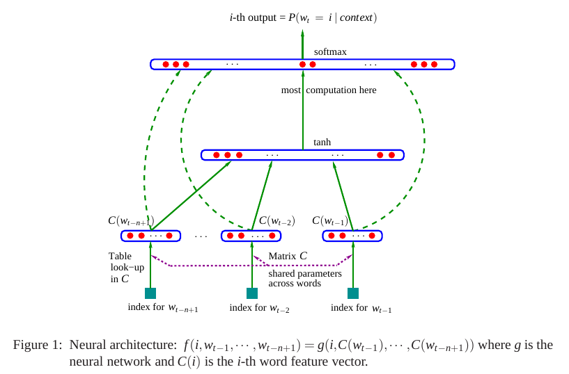
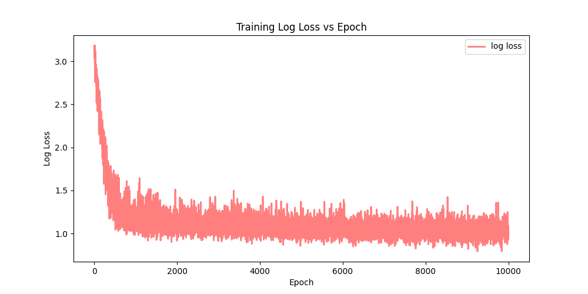

# Astronoetician: Leveraging Neural Nets to Sculpt Celestial Semantics

Astronoetician is a character-level language model that generates creative and novel names for celestial bodies. This project is inspired by the paper "A Neural Probabilistic Language Model" and aims to combine the realms of astronomy and language generation through neural networks.

## Features

- Utilizes a character-level language modeling architecture inspired by neural probabilistic language models.
- Generates unique and captivating names for celestial bodies, expanding the boundaries of language creativity.
- Allows customization of model parameters and hyperparameters to fine-tune name generation.
- Supports both training of the model on new datasets and generating names based on existing trained models.


## Architecture(as described in the paper):


## Dataset
The database contains the names of all the minor planets. The dataset is available in the `data` folder.

## Results
The model was trained for 10000 epochs and the following results were obtained:
```
Training Loss: 2.7625207901000977
Validation Loss: 2.812840461730957
Test Loss: 2.798530340194702
```
Plot of the training loss:


Few samples generated by the model:
```
Jimdun
Qalorill
Lan
Mentroce
Cuism
Hevan
Hus
Bicas
Jek
Likdos
Voro
Vibi
Maigi
Borgoetulu
Oler
Kutirs
Mepeikack
Sharhcser
Vudavi
Nrareres
```

## Usage

### Prerequisites

- Python (>=3.6)

Step 1: Clone the repository

```bash
git clone https://github.com/VishvamPorwal/Astronoetician.git
```

Step 2: Install the dependencies

```bash
pip install -r requirements.txt
```

Step 3: Train the model(Optional)

```bash
cd astronoetician
python train.py
```

Step 4: Generate names

```bash
python generate_planet_names.py
```

## Contributing
Contributions are welcome! Feel free to open issues and pull requests. For major changes, please open an issue first to discuss potential changes.

## License
[MIT](https://choosealicense.com/licenses/mit/)

## References
- [A Neural Probabilistic Language Model](https://www.jmlr.org/papers/volume3/bengio03a/bengio03a.pdf)